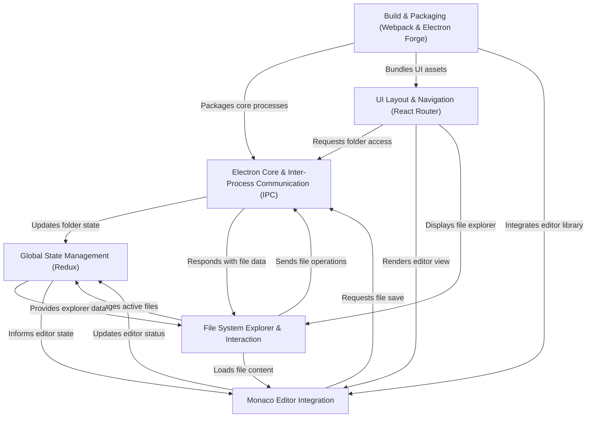

# Tutorial: code_editor_electron

This project is an **Electron-based code editor** that provides a *familiar and powerful coding environment* similar to VS Code. It allows users to *browse local file systems*, *open and edit various code files* with features like syntax highlighting, and *manage multiple open documents* seamlessly, all within a desktop application.

## Visual Overview

## Chapters

1. [UI Layout & Navigation (React Router)
](01_ui_layout___navigation__react_router__.md)
2. [File System Explorer & Interaction
](02_file_system_explorer___interaction_.md)
3. [Monaco Editor Integration
](03_monaco_editor_integration_.md)
4. [Electron Core & Inter-Process Communication (IPC)
](04_electron_core___inter_process_communication__ipc__.md)
5. [Global State Management (Redux)
](05_global_state_management__redux__.md)
6. [Build & Packaging (Webpack & Electron Forge)
](06_build___packaging__webpack___electron_forge__.md)

---

Generated by [AI Codebase Knowledge Builder](https://github.com/The-Pocket/Tutorial-Codebase-Knowledge).
